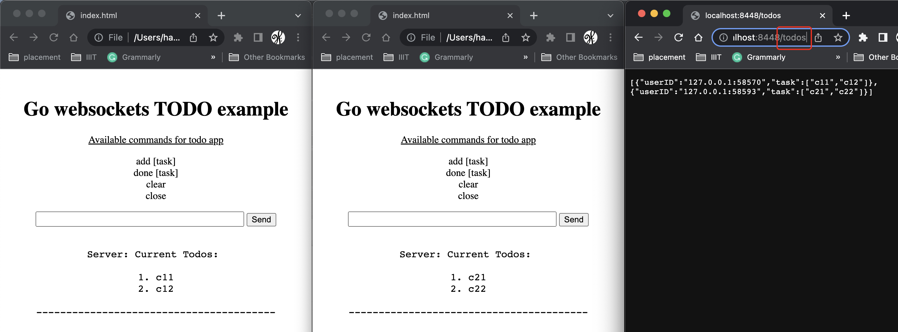

# Go Websockets TODO Example

This project demonstrates a simple TODO application using websockets in Go. The application allows users to perform operations like adding tasks, marking tasks as done, clearing tasks, and closing the websocket connection, all without the need to refresh the page.


## Overview

Websockets are a communication protocol that provides full-duplex communication channels over a single TCP connection. Unlike traditional HTTP requests, which are stateless and require a request-response cycle for each interaction, websockets enable real-time, bidirectional communication between the client (browser) and the server.

The purpose of websockets is to overcome the limitations of traditional request-response protocols by establishing a persistent connection that allows continuous, low-latency data transfer. Websockets are particularly useful for applications that require real-time updates or instant communication between the client and server.

## Run Instructions

To run the project, follow these steps:

1. Install Go on your system. You can download it from the official Go website: https://golang.org/
2. Open a terminal or command prompt and navigate to the project directory.
3. Run the following command to ensure that all required Go modules are installed:
   ```
   go mod tidy
   ```
4. Start the Go server by running the following command:
   ```
   go run main.go
   ```
5. Open the `index.html` file in a web browser.

## Credits

- [LWebApp](https://lwebapp.com/en/post/go-websocket-simple-server): The tutorial that inspired this project and provides guidance on setting up a basic Go websocket server.
- [LogRocket Blog](https://blog.logrocket.com/using-websockets-go/): A blog post that explains how to use websockets in Go and provides helpful insights into websocket programming.
